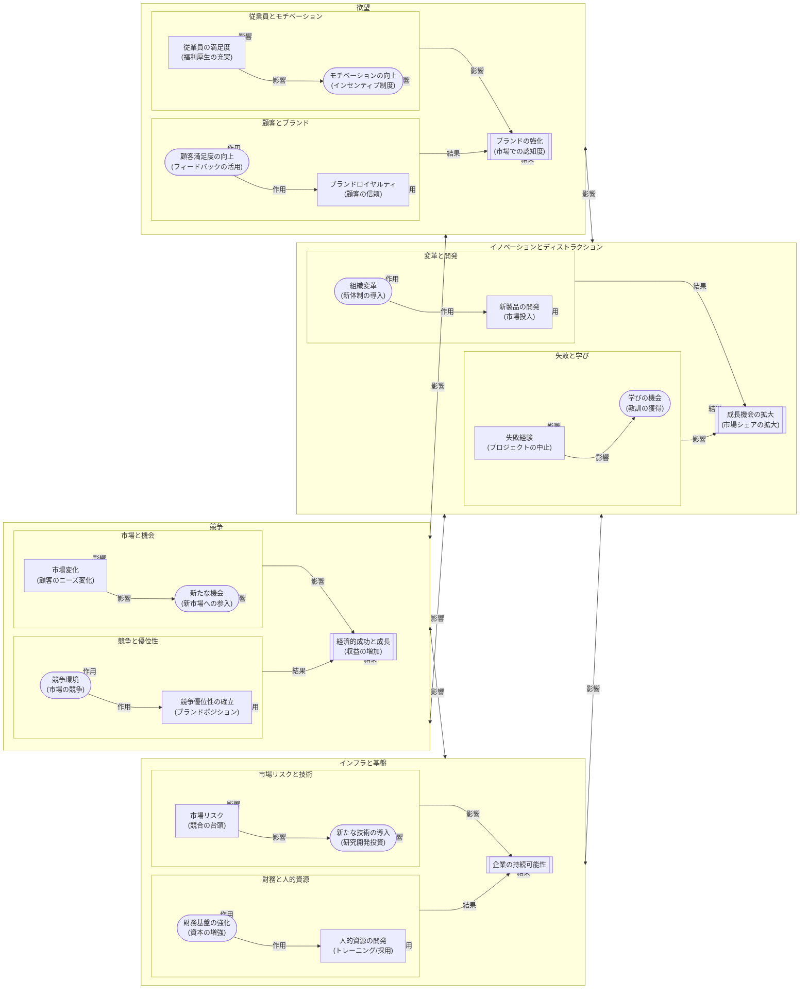

##企業版GIチャート

川（インフラと基盤）

財務基盤の強化 (資本の増強) と 人的資源の開発 (トレーニング/採用) は、企業の持続可能な基盤やリソースを指します。
作用: 財務基盤の強化と人的資源の開発が企業の持続可能性を支えます。
影響: 川の要素は欲望に影響を与え、従業員の満足度やモチベーションの強化を行います。
結果: これにより、企業の持続可能性がもたらされます。

火山（イノベーションとディストラクション）

組織変革 (新体制の導入) と 新製品の開発 (市場投入) は、変革や挑戦を促進する要因を指します。
作用: 組織変革と新製品の開発が成長機会の拡大をもたらします。
影響: 火山の要素は欲望に影響を与え、市場のニーズに応える新製品やサービスを提供します。
結果: これにより、成長機会の拡大がもたらされます。

欲望（顧客とブランド）

顧客満足度の向上 (フィードバックの活用) と ブランドロイヤルティ (顧客の信頼) は、顧客や従業員の満足度、ブランドロイヤルティを指します。
作用: 顧客満足度の向上とブランドロイヤルティがブランドの強化を促します。
影響: 欲望の要素は競争に影響を与え、競争力の向上や市場シェアの拡大を推進します。
結果: これにより、ブランドの強化がもたらされます。

競争

競争環境 (市場の競争) と 競争優位性の確立 (ブランドポジション) は、経済的成功と成長を促進する要因を指します。
作用: 競争環境と競争優位性の確立が経済的成功と成長を促します。
影響: 競争の要素は川（インフラと基盤）の強化と欲望のさらなる刺激を行います。

フローチャートの流れ

川（インフラと基盤）:

財務基盤の強化と人的資源の開発が企業の持続可能性を支えます。
市場リスクと新たな技術の導入が企業の持続可能性に影響を与えます。

火山（イノベーションとディストラクション）:

組織変革と新製品の開発が成長機会の拡大をもたらします。
失敗経験と学びの機会が成長機会の拡大に影響を与えます。

欲望（顧客とブランド）:

顧客満足度の向上とブランドロイヤルティがブランドの強化を促します。
従業員の満足度とモチベーションの向上がブランドの強化に影響を与えます。

競争:

競争環境と競争優位性の確立が経済的成功と成長を促します。
市場変化と新たな機会が経済的成功と成長に影響を与えます。

まとめ

このフローチャートは、企業が成長と成功を達成するために、どの要素がどのように相互作用し、影響を与えるかを視覚的に示しています。

